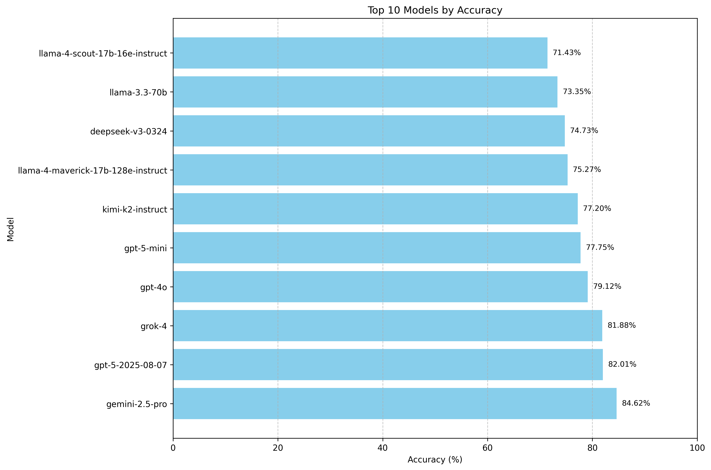
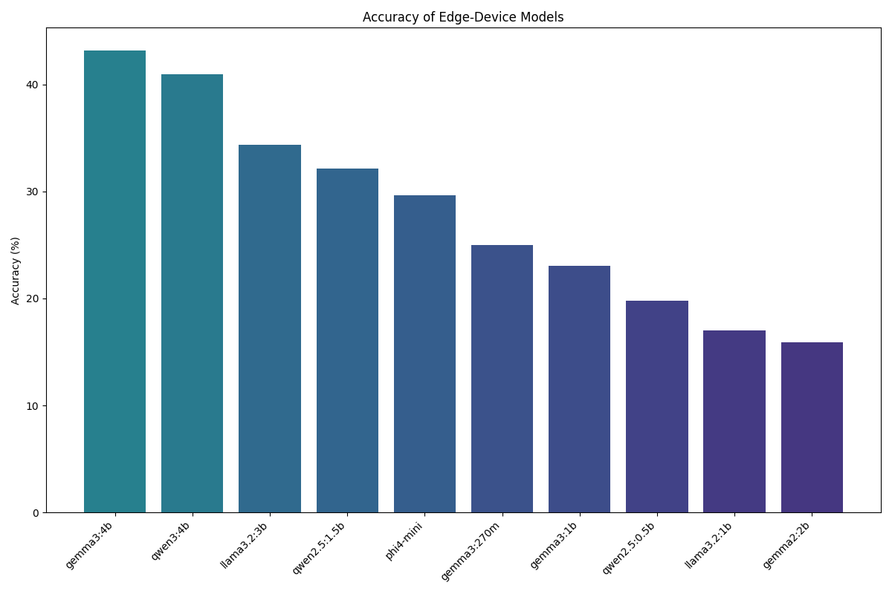

# ParsiEval: A Benchmark for Persian Language Understanding

This project introduces **ParsiEval**, a comprehensive benchmark designed to evaluate the performance of Large Language Models (LLMs) on Persian language tasks. The primary goal of ParsiEval is to provide a standardized and challenging testbed for assessing the capabilities of LLMs in understanding and reasoning in Persian.

## Dataset

The ParsiEval dataset consists of 364 multiple-choice questions that span a wide variety of topics, including:

- History
- Literature
- General Knowledge
- Science

Each question is designed to test a model's ability to comprehend context, recall facts, and make logical inferences in Persian.

## Goal and Motivation

The development of high-quality benchmarks for languages other than English is crucial for advancing the field of multilingual NLP. ParsiEval aims to fill this gap for the Persian language by providing a robust evaluation suite that can be used to:

- Track the progress of Persian language models over time.
- Identify the strengths and weaknesses of different model architectures.
- Drive research and development in Persian language technology.

## Results

Here are the results of the evaluation for different models. For detailed evaluation results, you can check the following JSON files:

- [API-based Models Evaluation Results](evaluation_results_api.json)
- [Local Models Evaluation Results](evaluation_results_local.json)

### Accuracy

#### Top Models
Analysis of the highest performing models

#### Edge-Device Models
Examination of smaller models suitable for edge devices

## Future Plan
 
### Dataset Expansion
- **Increase Question Volume**: Expand from 364 to 1000+ questions across all domains
- **Add New Domains**: Include categories such as:
- **Academic**: Educational and scholarly content
- **Business**: Commercial and economic topics
- **Food**: Culinary knowledge and food culture
- **History**: Historical events and figures
- **Literature**: Persian literature and literary analysis
- **Medical**: Healthcare and medical knowledge
- **Politics**: Political science and current affairs
- **Social Media**: Digital communication and social platforms
- **Technology**: Technical and scientific concepts
- **Arts and Culture**: Cultural heritage and art forms
- **Sports and Recreation**: Physical activities and leisure pursuits
- **Geography and Environment**: Landscapes, climates, and natural resources
- **Religion and Philosophy**: Belief systems and philosophical viewpoints
- **Law and Legal Studies**: Legal systems, principles, and practices

### Technical Enhancements
- **Leaderboard System**: Create a public leaderboard for tracking model performance over time
- **Multi-modal Extensions**: Explore incorporation of visual elements for comprehensive language understanding

### Research Directions
- **Academic Publication**: Publish research findings and benchmark results to arXiv for broader scientific community access
- **Cross-lingual Analysis**: Compare Persian model performance with other languages
- **Fine-tuning Studies**: Investigate optimal fine-tuning strategies for Persian language models
- **Cultural Adaptation**: Study the impact of cultural context on model performance

### Community Engagement
- **Open Source Contributions**: Encourage community contributions for question generation and validation
- **Academic Partnerships**: Collaborate with Persian language and NLP research institutions

### Long-term Vision
- **Standardization**: Establish ParsiEval as the de facto standard for Persian language model evaluation
- **International Recognition**: Promote adoption in international NLP conferences and competitions
- **Real-world Applications**: Bridge the gap between benchmark performance and practical Persian language applications
- **Continuous Evolution**: Maintain relevance through regular updates reflecting current language usage and cultural developments
