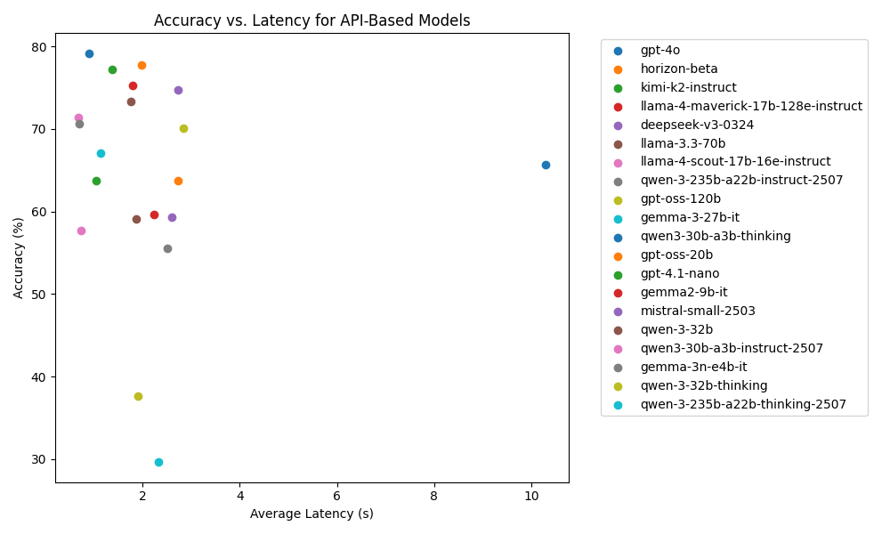
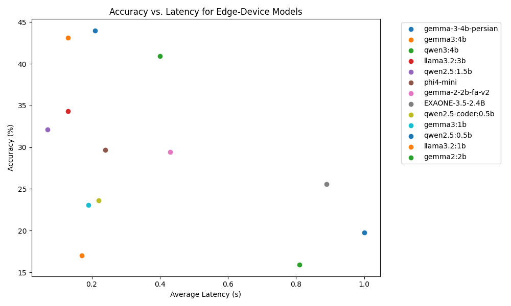
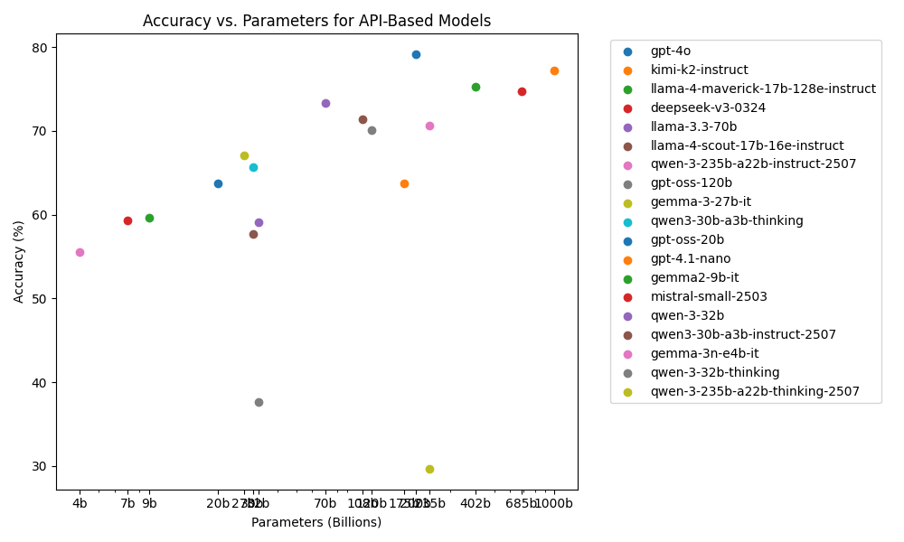
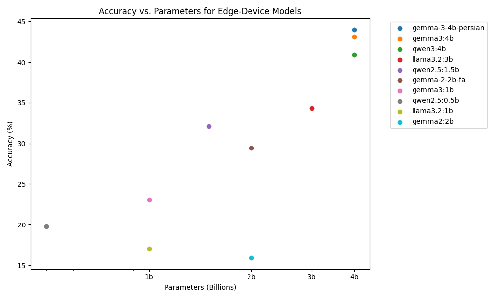

# ParsiEval: A Benchmark for Persian Language Understanding

This project introduces **ParsiEval**, a comprehensive benchmark designed to evaluate the performance of Large Language Models (LLMs) on Persian language tasks. The primary goal of ParsiEval is to provide a standardized and challenging testbed for assessing the capabilities of LLMs in understanding and reasoning in Persian.

## Dataset

The ParsiEval dataset consists of 364 multiple-choice questions that span a wide variety of topics, including:

- Science
- History
- Literature
- General Knowledge

Each question is designed to test a model's ability to comprehend context, recall facts, and make logical inferences in Persian.

## Goal and Motivation

The development of high-quality benchmarks for languages other than English is crucial for advancing the field of multilingual NLP. ParsiEval aims to fill this gap for the Persian language by providing a robust evaluation suite that can be used to:

- Track the progress of Persian language models over time.
- Identify the strengths and weaknesses of different model architectures.
- Drive research and development in Persian language technology.

## Results

Here are the results of the evaluation for different models.

### API-Based Models

These models were evaluated via their respective APIs (OpenAI, OpenRouter, Groq, Cerebras)

| Model                                  | Accuracy | Avg. Latency      | Reasoning | Parameters |
|:--------------------------------------|:--------:|:------------------:|:---------:|:----------:|
| gpt-4o                                | 79.12%   | 0.90s (OpenAI)     | No        | ~200B      |
| horizon-beta (likely gpt-5-mini)      | 77.75%   | 1.98s (OpenRouter) | Yes       | ~120B      |
| kimi-k2-instruct                      | 77.20%   | 1.37s (Groq)       | No        | 1T         |
| llama-4-maverick-17b-128e-instruct    | 75.27%   | 1.79s (Cerebras)   | No        | 402B       |
| deepseek-v3-0324                      | 74.73%   | 2.72s (OpenRouter) | No        | 685B       |
| llama-3.3-70b                         | 73.35%   | 1.75s (Cerebras)   | No        | 70B        |
| llama-4-scout-17b-16e-instruct        | 71.43%   | 0.68s (Cerebras)   | No        | 108B       |
| qwen-3-235b-a22b-instruct-2507        | 70.60%   | 0.70s (Cerebras)   | No        | 235B       |
| openai/gpt-oss-120b                   | 70.05%   | 2.84s (Groq)       | Yes       | 120B       |
| google/gemma-3-27b-it                 | 67.03%   | 1.13s (OpenRouter) | No        | 27B        |
| qwen/qwen3-30b-a3b-thinking           | 65.66%   | 10.29s (OpenRouter)| No        | 30B        |
| openai/gpt-oss-20b                    | 63.74%   | 2.73s (Groq)       | Yes       | 20B        |
| gpt-4.1-nano                          | 63.74%   | 1.05s (OpenAI)     | Yes       | ~175B      |
| gemma2-9b-it                          | 59.62%   | 2.24s (Groq)       | No        | 9B         |
| mistral-small-2503                    | 59.34%   | 2.60s (OpenRouter) | No        | 7B         |
| qwen-3-32b                            | 59.07%   | 1.86s (Groq)       | No        | 32B        |
| qwen3-30b-a3b-instruct-2507           | 57.69%   | 0.74s (OpenRouter) | No        | 30B        |
| gemma-3n-e4b-it                       | 55.49%   | 2.51s (OpenRouter) | No        | 4B         |
| qwen-3-32b-thinking                   | 37.64%   | 1.91s (Groq)       | Yes       | 32B        |
| qwen-3-235b-a22b-thinking-2507        | 29.67%   | 2.33s (Cerebras)   | Yes       | 235B       |

### Edge-Device Models (<4B)

These models were run on my local machine (RTX 3050 6GB) using ollama.

| Model                             | Accuracy | Avg. Latency | Reasoning | Parameters |
| --------------------------------- | -------- | ------------ | --------- | ---------: |
| gemma-3-4b-persian                | 43.96%   | 0.21s        |   No      | 4B         |
| gemma3:4b                         | 43.13%   | 0.13s        |   No      | 4B         |
| qwen3:4b (non-thinking)           | 40.93%   | 0.40s        |   No      | 4B         |
| llama3.2:3b                       | 34.34%   | 0.13s        |   No      | 3B         |
| qwen2.5:1.5b                      | 32.14%   | 0.07s        |   No      | 1.5B       |
| gemma-2-2b-fa-v2                  | 29.40%   | 0.43s        |   No      | 2B         |
| phi4-mini                         | 29.67%   | 0.24s        |   No      | 1.6B       |
| EXAONE-3.5-2.4B                   | 25.55%   | 0.89s        |   No      | 2.4B       |
| qwen2.5-coder:0.5b                | 23.63%   | 0.22s        |   No      | 0.5B       |
| gemma3:1b                         | 23.08%   | 0.19s        |   No      | 1B         |
| qwen2.5:0.5b                      | 19.78%   | 1.00s        |   No      | 0.5B       |
| llama3.2:1b                       | 17.03%   | 0.17s        |   No      | 1B         |
| gemma2:2b                         | 15.93%   | 0.81s        |   No      | 2B         |
## Analysis

### Accuracy

#### Top Models
Analysis of the highest performing models

#### Edge-Device Models
Examination of smaller models suitable for edge devices

### Accuracy vs Latency

#### Top Models
Evaluation of the trade-off between accuracy and response time

#### Edge-Device Models
Analysis of speed-performance balance in edge models

### Accuracy vs Parameters

#### Top Models
Investigation of the relationship between model size and performance

#### Edge-Device Models
Assessment of performance scaling in small models (<4B parameters)

