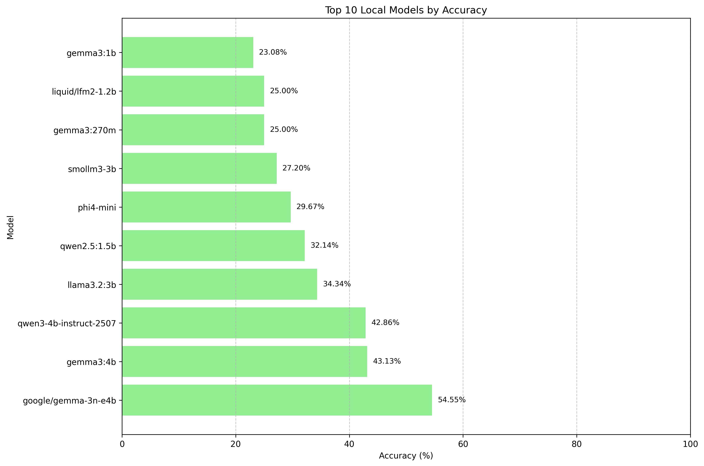

# ParsiEval: A Benchmark for Persian Language Understanding

This project introduces **ParsiEval**, a comprehensive benchmark designed to evaluate the performance of Large Language Models (LLMs) on Persian language tasks. The primary goal of ParsiEval is to provide a standardized and challenging testbed for assessing the capabilities of LLMs in understanding and reasoning in Persian.

## Dataset

The ParsiEval dataset consists of 364 multiple-choice questions that span a wide variety of topics, including:

- History
- Literature
- General Knowledge
- Science

Each question is designed to test a model's ability to comprehend context, recall facts, and make logical inferences in Persian.

## Goal and Motivation

The development of high-quality benchmarks for languages other than English is crucial for advancing the field of multilingual NLP. ParsiEval aims to fill this gap for the Persian language by providing a robust evaluation suite that can be used to:

- Track the progress of Persian language models over time.
- Identify the strengths and weaknesses of different model architectures.
- Drive research and development in Persian language technology.

## Results

Here are the results of the evaluation for different models:

| Rank | Model | Size | License | API Provider | Avg Latency | Total Latency | Accuracy |
|------|-------|------|---------|----------|-------------|---------------|----------|
| 1 | gemini-2.5-pro | unknown | proprietary | openrouter | 8.87s | 3230.16s | 84.62% |
| 2 | gpt-5-2025-08-07 | unknown | apache-2.0 | openai | 6.08s | 2297.52s | 82.01% |
| 3 | grok-4 | unknown | proprietary | openrouter | 11.59s | 1599.73s | 81.88% |
| 4 | gpt-4o | unknown | proprietary | openai | 0.90s | 326.08s | 79.12% |
| 5 | gpt-5-mini | unknown | proprietary | openrouter | 1.98s | 721.03s | 77.75% |
| 6 | kimi-k2-instruct | 1000b | modified-mit | cerebras | 1.37s | 497.76s | 77.20% |
| 7 | llama-4-maverick-17b-128e-instruct | 17b | open-weight-llama4 | openrouter | 1.79s | 651.43s | 75.27% |
| 8 | deepseek-v3-0324 | 685 | mit | openrouter | 2.72s | 991.41s | 74.73% |
| 9 | llama-3.3-70b | 70b | open-weight-llama3.3 | cerebras | 1.75s | 638.42s | 73.35% |
| 10 | llama-4-scout-17b-16e-instruct | 17b | open-weight-llama4 | cerebras | 0.68s | 247.32s | 71.43% |
| 11 | qwen-3-235b-a22b-instruct-2507 | 235b | apache-2.0 | cerebras | 0.70s | 253.16s | 70.60% |
| 12 | gpt-oss-120b | 120b | apache-2.0 | cerebras | 2.84s | 1034.47s | 70.05% |
| 13 | gemma-3-27b-it | 27b | open-weight-gemma | openrouter | 1.13s | 409.72s | 67.03% |
| 14 | qwen3-30b-a3b-thinking | 30b | apache-2.0 | openrouter | 10.29s | 3744.42s | 65.66% |
| 15 | gpt-oss-20b | 20b | apache-2.0 | cerebras | 2.73s | 994.36s | 63.74% |
| 16 | gpt-4.1-nano | unknown | proprietary | openai | 1.05s | 382.53s | 63.74% |
| 17 | gemma2-9b-it | 9b | open-weight-gemma | groq | 2.24s | 815.02s | 59.62% |
| 18 | mistral-small-2503 | 24 | apache-2.0 | openrouter | 2.60s | 948.16s | 59.34% |
| 19 | qwen-3-32b | 32b | apache-2.0 | groq | 1.86s | 677.18s | 59.07% |
| 20 | qwen3-30b-a3b-instruct-2507 | 30b | apache-2.0 | openrouter | 0.74s | 267.75s | 57.69% |
| 21 | gemma3:4b | 4B | open-weight-gemma | ollama | 0.13s | 46.63s | 43.13% |
| 22 | qwen3:4b | 4B | apache-2.0 | ollama | 0.40s | 145.36s | 40.93% |
| 23 | qwen-3-32b-thinking | 32b | apache-2.0 | openrouter | 1.91s | 693.84s | 37.64% |
| 24 | llama3.2:3b | 3B | open-weight-llama3 | ollama | 0.13s | 46.11s | 34.34% |
| 25 | qwen2.5:1.5b | 1.5B | apache-2.0 | ollama | 0.07s | 24.79s | 32.14% |
| 26 | qwen-3-235b-a22b-thinking-2507 | 235b | apache-2.0 | cerebras | 2.33s | 849.16s | 29.67% |
| 27 | phi4-mini | 1.3B | mit | ollama | 0.24s | 88.75s | 29.67% |
| 28 | gemma3:270m | 270M | open-weight-gemma | ollama | 0.16s | 58.82s | 25.00% |
| 29 | gemma3:1b | 1B | open-weight-gemma | ollama | 0.19s | 70.21s | 23.08% |
| 30 | gemma-3-270m-it | 270m | open-weight-gemma | lmstudio | 0.04s | 14.47s | 22.25% |
| 31 | qwen2.5:0.5b | 0.5B | apache-2.0 | ollama | 1.00s | 365.51s | 19.78% |
| 32 | llama3.2:1b | 1B | open-weight-llama3.2 | ollama | 0.17s | 63.05s | 17.03% |
| 33 | gemma2:2b | 2B | open-weight-gemma | ollama | 0.81s | 295.59s | 15.93% |

### Accuracy

#### Top Models
Analysis of the highest performing models

#### Local Models
Examination of models running on local hardware

## Future Plan
 
### Dataset Expansion
- **Increase Question Volume**: Expand from 364 to 1000+ questions across all domains
- **Add New Domains**: Include categories such as:
- **Academic**: Educational and scholarly content
- **Business**: Commercial and economic topics
- **Food**: Culinary knowledge and food culture
- **History**: Historical events and figures
- **Literature**: Persian literature and literary analysis
- **Medical**: Healthcare and medical knowledge
- **Politics**: Political science and current affairs
- **Social Media**: Digital communication and social platforms
- **Technology**: Technical and scientific concepts
- **Arts and Culture**: Cultural heritage and art forms
- **Sports and Recreation**: Physical activities and leisure pursuits
- **Geography and Environment**: Landscapes, climates, and natural resources
- **Religion and Philosophy**: Belief systems and philosophical viewpoints
- **Law and Legal Studies**: Legal systems, principles, and practices

### Technical Enhancements
- **Leaderboard System**: Create a public leaderboard for tracking model performance over time
- **Multi-modal Extensions**: Explore incorporation of visual elements for comprehensive language understanding

### Research Directions
- **Academic Publication**: Publish research findings and benchmark results to arXiv for broader scientific community access
- **Cross-lingual Analysis**: Compare Persian model performance with other languages
- **Fine-tuning Studies**: Investigate optimal fine-tuning strategies for Persian language models
- **Cultural Adaptation**: Study the impact of cultural context on model performance

### Community Engagement
- **Open Source Contributions**: Encourage community contributions for question generation and validation
- **Academic Partnerships**: Collaborate with Persian language and NLP research institutions

### Long-term Vision
- **Standardization**: Establish ParsiEval as the de facto standard for Persian language model evaluation
- **International Recognition**: Promote adoption in international NLP conferences and competitions
- **Real-world Applications**: Bridge the gap between benchmark performance and practical Persian language applications
- **Continuous Evolution**: Maintain relevance through regular updates reflecting current language usage and cultural developments
